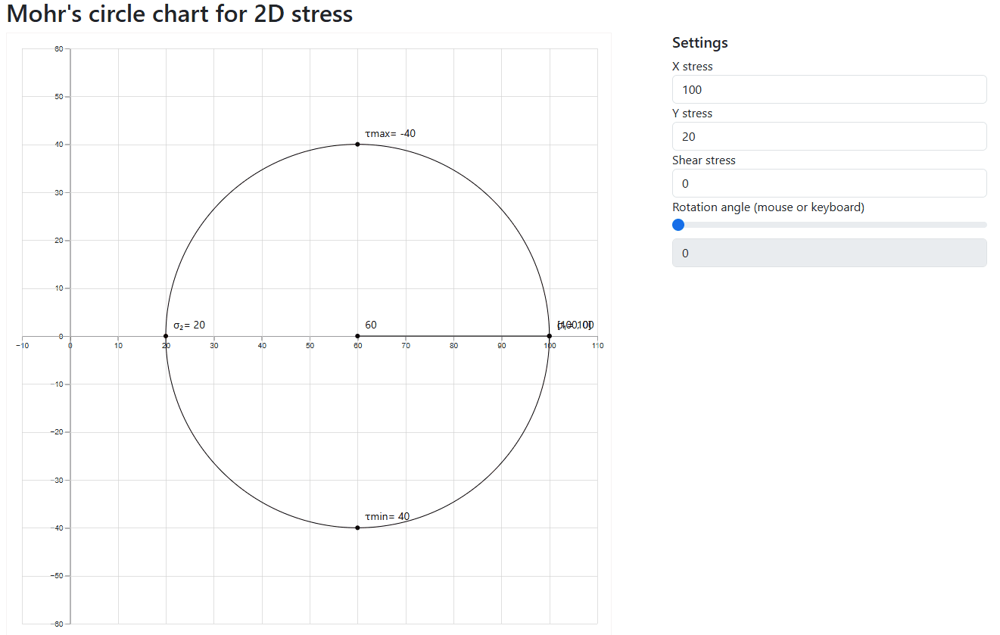

# Geomechanics Lab 1
An interactive web app to visualize 2D Mohr’s Circle and basic dynamic params for stress analysis in geomechanics.

## Project Overview

This project is a simple lab tool for understanding the fundamentals of geomechanics, specifically 2D stress states. It allows users to:

- Input principal stresses and shear stress
- Input rotation angle
- Visualize Mohr’s Circle

## Geomechanics domain background

#### Principal Stresses
- Convention: **σ₁ ≥ σ₂ **
- Represents normal stresses along principal directions

#### Mohr’s Circle
- A graphical representation of the state of stress at a point
- Shows the variation of shear and normal stress on different planes

## Features
- Interactive input for σ₁, σ₂
- Real-time Mohr’s Circle visualization
- Example stress states to load and visualize

## Demo

  

## Url

TODO